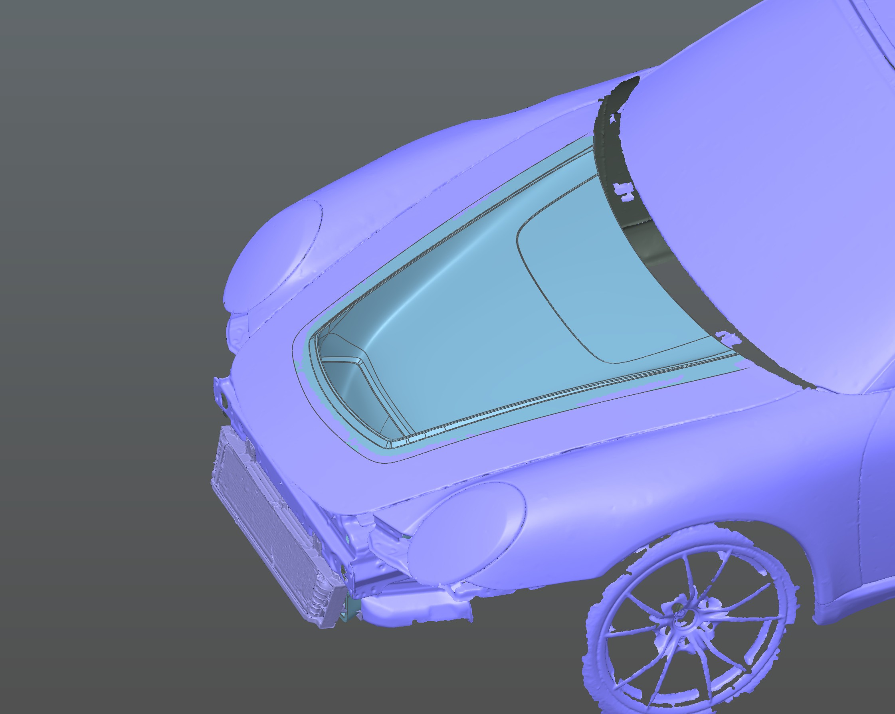
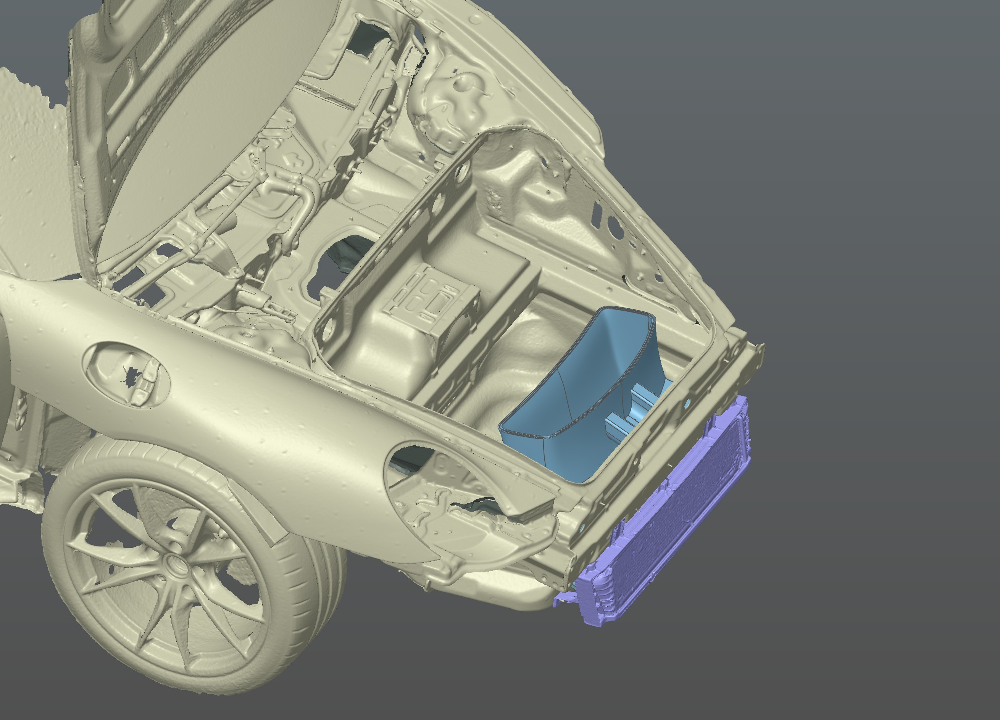
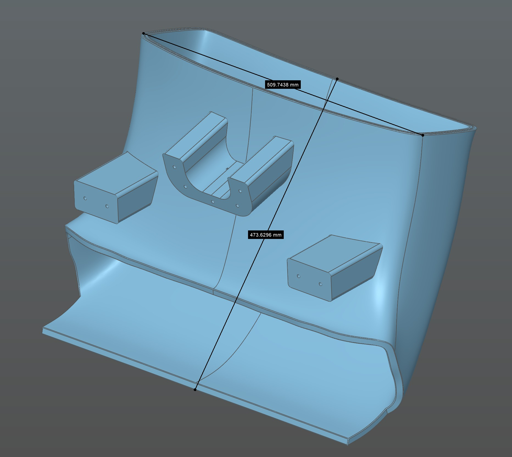
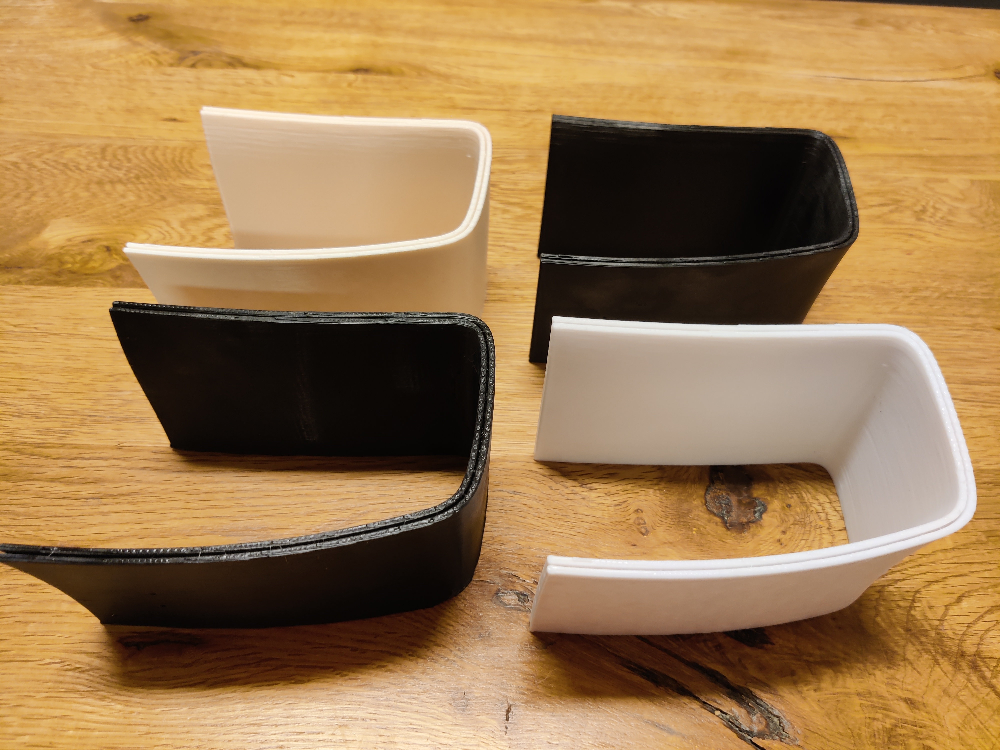
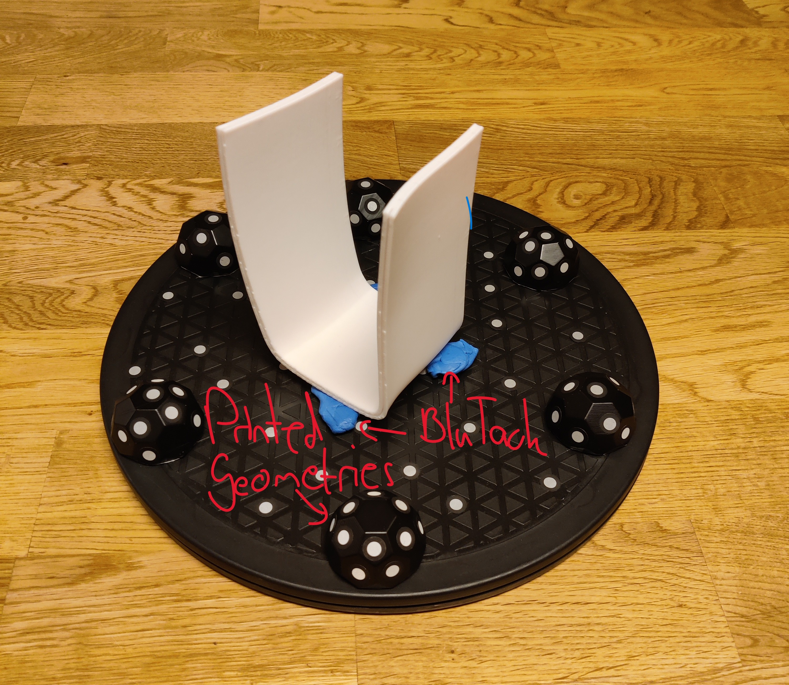
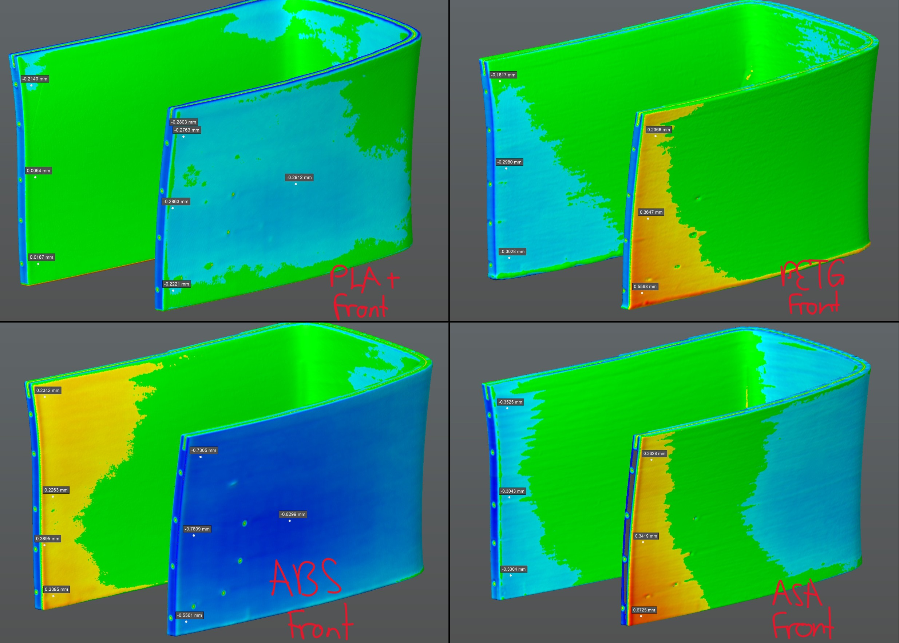
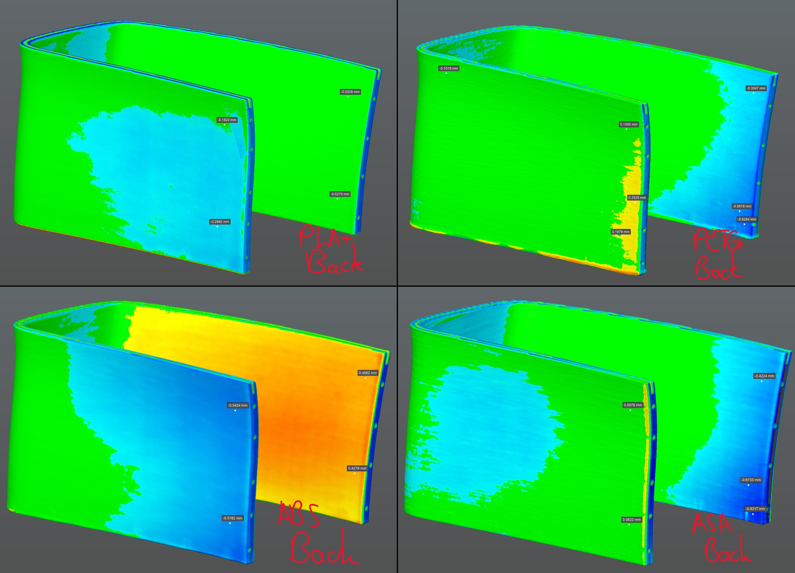

# Filament Shrinkage Comparison
## Background
When I saw the #WhyIScan from @Creality3DScanner (I am not affiliated to or sponsored by Creality) some thoughts appeared: What advantage created scanning for me? What problems couldn't I tackle before scanning?
To answer: The ideal design workflow should have feedback-loops. I measure (initially with a ruler), design, manufacture and improve the design with a new iteration. Scanning changed all of these aspects. Gathering of measurements is much more reliable and accurate and I can even go back to my scan while designing and remeasure or completely reverse-engineer the part for a faster and better result.  
Measuring and designing got very reliable with high-quality scans and proper software, namely Creality Scan for scanning, Quicksurface Pro for post-processing as well as reverse-engineering and Fusion360 for designing. The main bottle-neck in my process is the manufacturing step. For very large 3d-printed parts from materials, like ABS, ASA and Nylon, shrinkage and warping are big obstacles to overcome.

## Project - Large ASA-prints
A recent project where I encountered this problem was a Porsche body-kit including air-guides for the front-center intercooler. Main parts like hood-insert and exterior will be laminated from carbon but the internal parts may be printed for cost-saving and faster adaptability.  

### Hood-Insert external view:

### Internal Parts (Scan: Sermoon S1 NIR large, feature-tracking)

### Part Size:

The internal parts consist of an air-guide and mounting brackets. Due to the printability the air-guide hat to be split in four pieces which will later be connected with 2mm steel-rods and glue. The first prints were from ASA since I wanted the befits of temperature resistance and lower density. Parts were printed with my K2 Plus at 110°C bed and 60°C chamber and came out nicely. But when trying to glue the parts together I noticed the parts were bent. You have to differenciate it from warping which it was not, it mas more like they sprung into a slightly wrong shape due to shrinkage or internal stresses. With PLA+ I used to print all other parts of the body-kit (~150kg of it) no such issues were encountered so I decided to gather further data to back my findings and compare the issue with different filaments to hopefully find a fitting candidate for my application.

## Test Setup
I took the worst part of the air-guide and scaled it down to 50% in order to speed up print time and reduce filament waste.

### Filaments Tested:
- Jayo PLA Plus (white, freshly opened)
- Geetech PETG (black, freshly opened, additionally dried)
- K5 (no-name I guess) ABS (white, years old, freshly dried)
- Sunlu ASA (black, freshly opened)

### Print Settings
Normally I print with a 0.8mm nozzle at 0.4mm layer height on my K2 Plus. For the test I switched to a 0.6mm nozzle and 0.3mm layer height to somewhat compensate the scaling of the part. Two walls and 17.5% infill were used with the speed set to fully use each filaments flowrate (determined with a max flowrate test, on  my K2 Plus with a 0.6mm nozzle roughly 30-35mm3).  
One important factor to mitigate warping and prevent to much internal stresses is the chamber-heater: 35°C for PLA+, 40°C for PETG and 60°C for ABS and ASA. The K2 Plus easily reaches the 60°C early in the print so heating shouldn't be the problem. To further reduce risk of warping a 10mm brim was used

### Print Results
  

All four prints came out nicely and only post-processing was to brim removing

### Scanning Setup
  

My main scanner for small to medium parts is the Sermoon S1. It performes extremely well in laser and NIR-mode (link to my review: https://printedforfun.github.io/review_creality_sermoon_s1 ) and with the scan-bridge wireless scans are a breeze. Since I wanted to capture the scans fast I decided to use a wired connection to fully utilize the 90FPS and of each printed part 3 scans were made: top, bottom and side (added later to improve auto-alignment result).  
Scans were performed in parallel and cross lines with a target resolution of 0.2mm which was also used for fusion and meshing. The marker geometries allow easy scanning in otherwise impossible angles and therefore eliminate the need for markers on the printed parts themselves (for the first two I used some but later didn't bother since the results were good enough without). Prints were fixed with blue-tack to prevent the parts moving while rotating the turntable. For the same reason I added anti-slip pads to my marker geometries.

After aligning and meshing the scans were imported to Quicksurface and aligned to the CAD-model by picking points and then performing an optimization. The picked points were in the turn of the part since most deviation was present in the free-standing sides which would have made it quite difficult to align otherwise. Other tools like Geomagic of Zeiss Inspect could have been used but I started with QuickSurface and the Pro-version provides - for the moment - all features I need for my work. Especially the Analysis options are excellent to highlight deviation from CAD to scan (and also between scans for those who didn't know).

### The Results
Deviation analysis was performed for each print compared to the ideal CAD-model. Target deviation is set to 0.2mm which means everything coloured green is within +- 0.2mm  from the CAD-model. Yellow to red indicates the scan to be positively outside the range, whereas blue indicates negative deviation. The following screenshots also contain measurements, you may need to open them separately or zoom in since the font in Quicksurface is quite small.    

Firstly let's look at the frontal lip (you are looking from the front of the car):

  

From fist look you can directly spot one print positively standing out: PLA+ has the least deviation with a slight blue haze on the outside (max ~0.3mm) and almost nothing else than green on the inside. PETG and ASA provide a similar result with slightly worse results with the ASA-part: The duct bows outwards indicated by the red patches on the outside. Maximum deviation for PETG is ~0.6mm whereas ASA is ~0.7mm. In contrast to this behavior the ABS-part is bowing inwards up to ~0.8mm. Personally I would have guessed ASA and ABS to behave more similar.

The general results also apply the the back lip but are less pronounced (you are looking from the back of the car):  

  

PLA+ has the least deviation, PETG and ASA slightly bow outward and ABS more prominently inward.

### Conclusion
The tests backed my experience from recent projects and reinforced my decision to use PLA+ for most large parts, especially for mould-making. Only downside of PLA+ is the low heat-deflection temperature, the Jayo brand PLA+ seems to have a slightly better temperature resistance (GF-molds were no problem). ABS and ASA provide too much deviation for my use cases since I need their properties for large and thin parts. Therefore PETG will be a suitable choice for the moment, when I get my hands on a roll of CF-ASA I will redo the test with it.  
Scanning now allows me to have an ace up my sleeve by possibly designing a counter-bow for parts that must be printed from ASA or ABS. With the Sermoon S1 quickly and reliably scanning parts is a breeze.  
A short addendum: Initially I mainly printed PETG but switched to ABS where possible since it felt "cooler". After some time I got my senses back and started using mostly PETG and PETG-CF again.